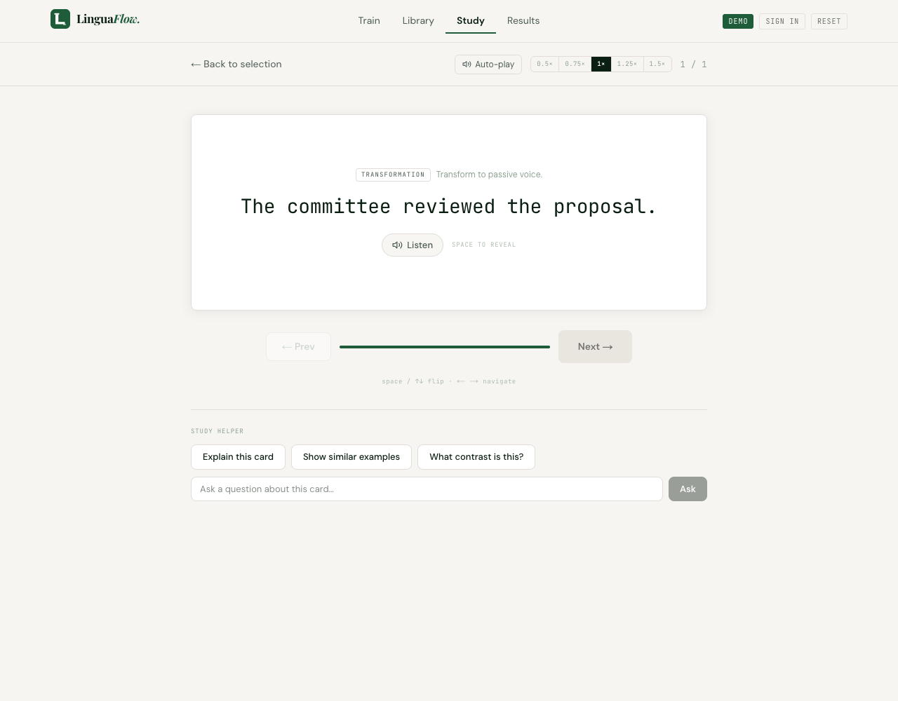
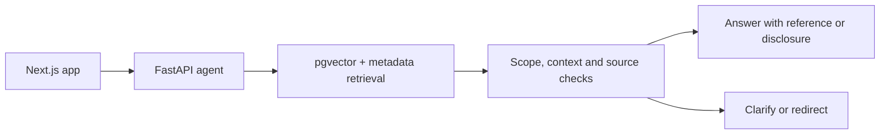

# LinguaFlow

**An English tutor that explains why a rewrite works, with teaching references learners can inspect.**

Built with Next.js, FastAPI, LangGraph and PostgreSQL/pgvector. The engineering focus is the RAG pipeline: reliable data, relevant references, explicit fallback behavior and reproducible evaluation.

[Try the demo](https://linguaflow-demo.vercel.app) · [Engineering case study](docs/RAG_ENGINEERING_CASE_STUDY.md) · [Evaluation results](docs/RELEASE_VALIDATION_RESULTS.md)



*Recorded from the live English Study flow. Pauses are edited; [capture details](docs/demo/english-study-capture.json).*

## The problem

A fluent explanation can still teach the wrong rule. Changing “I may finish” to “I have finished,” for example, changes both certainty and completion. A tutor should explain that distinction, cite a relevant rule when available, and ask for context when the learner has not supplied enough information.

LinguaFlow combines timed drills, conversational coaching and study cards. Learners can ask for explanations, see the selected teaching reference, and rate the response. A session planner recommends what to practice next.

**Why RAG?** It makes the teaching curriculum editable and its source choices inspectable. With only 31 notes, putting the entire corpus in the prompt is also a credible alternative; the experiments do not establish that RAG always produces better answers.

## What I built

| Area | Implementation and reasoning |
|---|---|
| **Data pipeline** | 171 canonical English drills and 31 teaching notes, with examples, counterexamples and 11 external references. Validation checks IDs, relationships and content structure before indexing. |
| **Retrieval** | One concept per chunk; `text-embedding-3-small` embeddings; pgvector candidates reranked with card metadata. Short notes keep rules and qualifications together. |
| **Source and context checks** | One bounded verification call checks task scope, missing learner text and evidence support. Uncovered questions get an explicit disclosure; incomplete questions get clarification. |
| **Index reliability** | Atomic publication and corpus/model fingerprints prevent partial or incompatible indexes from being served. Provider and index failures return explicit errors. |
| **Evaluation** | Separate retrieval, answer-quality and latency/token/cost metrics. Frozen plans, saved outputs and offline replay keep experiments inspectable—including failed attempts. |

## Measured results

**Latest frozen test: 24 synthetic questions** covering supported questions, uncovered English questions, missing context and out-of-scope requests.

| Measure | Result |
|---|---:|
| Selected references that were correct | **11/11** |
| Supported questions that received a correct reference | **11/12** |
| False references on negative cases | **0/12** |
| Required clarifications / scope redirects | **4/4 / 4/4** |
| Local pipeline p95 latency | **4.60 s** |
| Mean pipeline token cost, excluding evaluation judge | **$0.00433/request** |

**269 Python tests passed**, including disposable PostgreSQL/pgvector integration. CI also runs web lint, type checks, tests, build, guest browser tests and evaluation replay.

These are small, AI-authored synthetic tests; answer-quality scores use an AI judge. One source was still missed. The timings are from an instrumented local pipeline, not a production load test. Earlier failures, confidence intervals, answer metrics and exact configurations are in the [full evaluation report](docs/RELEASE_VALIDATION_RESULTS.md).

## How it works



This is the **Study freeform** path. Card-based explanations use metadata retrieval; the conversational tutor uses LangGraph routing. Supabase handles authentication and persistence. [Read the design decisions and trade-offs →](docs/RAG_ENGINEERING_CASE_STUDY.md)

## Try it

Open the [demo](https://linguaflow-demo.vercel.app), choose **Begin Training → English**, and complete a short session. Open **Coach** on a drill to ask for an explanation. Guest mode requires no account.

The free backend host can take time to wake up. The recording above provides a quick product preview; [deployment evidence](docs/RELEASE_EVIDENCE_STATUS.md) identifies which backend revisions were verified.

## Explore the engineering

| Interested in… | Start here |
|---|---|
| Problem, architecture and design trade-offs | [Engineering case study](docs/RAG_ENGINEERING_CASE_STUDY.md) |
| Data selection, cleaning and provenance | [Dataset card](docs/DATASET_CARD.md) |
| Metrics, failure analysis and reproducibility | [Evaluation report](docs/RELEASE_VALIDATION_RESULTS.md) |
| Running the app and tests | [Local development](docs/LOCAL_DEVELOPMENT.md) |
| Hosting, migrations and operations | [Deployment runbook](docs/DEPLOYMENT.md) |

## Run locally

For the guest web app, with Node.js 20+ and pnpm:

```bash
pnpm install
pnpm dev
```

Open [localhost:3000](http://localhost:3000). AI features need the Python agent and provider configuration; freeform RAG also needs a published pgvector index. See the [setup guide](docs/LOCAL_DEVELOPMENT.md).

---

[MIT License](LICENSE) · JL200126
