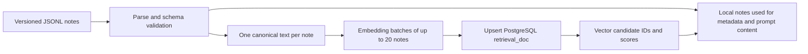

# LinguaFlow: building and evaluating a curriculum-grounded tutor

**Index update:** [Atomic publication and version checks](INDEX_PUBLICATION.md) are implemented locally. The full Python suite passed against a disposable PostgreSQL/pgvector database: **146 tests, zero skips**. No application database migration or provider-backed reindex has run.


**Retrieval experiment update:** [Experiment 01](RETRIEVAL_EXPERIMENT_01.md) now provides a fixed BM25 baseline, paired rankings, threshold sensitivity, and a pending relevance-review packet. The data corpus and serving policy are unchanged.


## 1. Problem and success criteria

A learner can see the correct answer to an English drill without understanding the distinction it tests. For example, replacing “get approval” with “obtain approval” is about register and precision; an explanation about tense would be fluent but teach the wrong lesson. The product needs short explanations that connect the learner's card to the appropriate teaching concept and give a different example they can transfer to the next exercise.

LinguaFlow separates the exercise, a reusable reference corpus, retrieval, and response generation. The intended benefit is consistent, inspectable teaching guidance. Improved learning outcomes have not been measured.

Success has several independent meanings:

- **Retrieval:** select the appropriate note, or return no reference when the corpus does not cover the question.
- **Generation:** explain the card accurately using the selected guidance, without inventing support.
- **Pedagogy:** preserve the intended distinction and provide a useful example.
- **Operations:** diagnose wrong selections and distinguish unavailable services from genuine no-match results.

A retrieval hit is not proof of any of the other three.

## 2. Why retrieval, and when it is unnecessary

A general language model already knows much of this English material. RAG is useful here because the application has its own curriculum, preferred explanations, and examples. Those references can be edited and selected independently of the response model, and the selected note can be shown to the learner and inspected during debugging.

RAG is not a prerequisite for answering basic English questions. The defensible hypothesis is that selecting curriculum-specific evidence improves consistency and makes failures easier to inspect. That hypothesis still needs an answer-quality comparison.

| Alternative | Where it fits | Why this project explores retrieval |
| --- | --- | --- |
| LLM with card context only | Simple initial tutor | No explicit selection of curriculum guidance; useful no-RAG baseline |
| Direct item-to-note lookup | Known authored drills | Strong, simple baseline already represented by metadata scoring; limited for new wording and freeform questions |
| Entire corpus in the prompt | Small curated corpus | Feasible here; should be evaluated before claiming retrieval is necessary for context limits |
| Selected reference plus LLM | Questions covered by the curriculum | Limits reference context and exposes a specific selection decision, but adds retrieval errors and infrastructure |
| Fine-tuning | Consistent response style or behavior with sufficient examples | Updating reference content alone does not justify a training pipeline; no fine-tuning experiment was performed |

The current canonical embedding texts total **6,265 tokens** across 31 notes (`cl100k_base`, measured 2026-09-15). This is a small corpus. Whole-corpus prompting is a credible comparator; the project does not claim the corpus exceeds a model's context window. That token count excludes additional prompt instructions and non-embedded note fields.

## 3. Data source and representation

The [v2 dataset card](DATASET_CARD.md) is the detailed data contract. The 171 canonical English drills are shared between the app and validator. The 31 curated notes contain applicability, original examples, exact drill adaptations, explained counterexamples, source IDs, selection rationale, and review status. Eleven institutional reference records support named principles; they do not certify every example or domain claim. Independent human review is pending.

`source_item_id` identifies a canonical drill adaptation; original examples use null and have independent example IDs. Bibliographic references use `reference_ids` and a bounded `reference_scope`. The dataset remains authored curriculum, not a web crawl or upload pipeline.

## 4. Ingestion and data cleaning

The loader validates JSONL and rejects duplicate document IDs with line-aware parsing errors. The offline bundle validator additionally checks identities, fields, source relationships, exact adaptations, all-drill coverage dispositions, revision after-values, evaluation provenance, concept gold coverage, and a conservative chunk byte budget. It runs in CI and before indexing. Reports contain deterministic bundle fingerprints.

The editorial pass revised 99 drills, preserved meaning-sensitive punctuation/text, and added three original positives plus an explained counterexample per note. [The change ledger](DATA_CHANGELOG.md) links the exact before/after edits. These are AI-assisted corrections with source checks; structural validation does not establish linguistic correctness. Semantic deduplication, PII detection, and a quarantine queue are not implemented. Source verification is recorded, not automated monitoring.

## 5. Chunking: one teaching note per vector

[format_chunk_text](../agent/retrieval/embeddings.py) builds one canonical chunk from:

```text
Title: ...
When to use: ...

Explanation: ...

Examples:
- ... (up to four)

Boundary (incorrect example; do not imitate): ...
Why incorrect: ...
Tags: ...
```

The current 31 formatted chunks contain **175–243 tokens**, median **200**, measured using `cl100k_base`. The formatter does not enforce these bounds; they describe this corpus snapshot.

**Rationale:** a teaching rule, its usage conditions, and its examples form a useful semantic unit. Splitting a short note into fixed windows could retrieve an example without the rule that makes it relevant. There is no overlap because the notes are already self-contained; no recursive or embedding-based chunk-boundary algorithm is implemented.

**Tradeoffs:** more examples may improve query matching but can dilute the concept representation. Limiting to four privileges example order and has not been tuned. A single-note chunk can also contain multiple ideas if editorial discipline slips. The embedded text omits raw IDs, route eligibility, and `avoid`; identity and routing remain structured, while `avoid` can still be included in the generation prompt.

For longer future sources, evaluate section-aware splitting that retains a concept/parent ID and keeps rules adjacent to examples. Compare it to whole-note chunks using candidate recall and answer support. Do not adopt a fixed chunk size solely because it is common in RAG tutorials.

## 6. Embedding model decision

The code uses **`text-embedding-3-small`, explicitly requesting 1,536 dimensions**, for both document and query embeddings. This is an implemented starting configuration, not the winner of a completed model bake-off.

A practical rationale is a hosted general-purpose embedding model with modest integration effort for short English notes. The existing database column is `vector(1536)`. OpenAI documents 1,536 as this model's default, 3,072 for `text-embedding-3-large`, and support for reducing dimensions; it also documents cosine similarity and `cl100k_base` tokenization for these models. [Official embedding documentation](https://developers.openai.com/api/docs/guides/embeddings).

The project-specific question is whether another model improves difficult distinctions enough to justify its cost, dependency, or migration work. General benchmark scores cannot answer that.

| Candidate experiment | Potential value | What must be checked |
| --- | --- | --- |
| Current model at 1,536 dimensions | Existing simple baseline | Held-out relevance, query latency, service reliability |
| Same model with fewer dimensions | Smaller vectors | Lost distinctions; schema/index changes; re-embedding both sides consistently |
| Larger hosted embedding model | Potentially better semantic distinctions | Measured gain on ambiguous/domain-specific cases versus cost and latency |
| Locally served embedding model | Deployment/data-control flexibility | Local inference resources, operations, tokenizer/pooling conventions, actual retrieval quality |

Keep corpus, queries, labels, and candidate budget fixed during comparison. Use a separate index per embedding configuration; vector length alone does not identify a compatible embedding space. Select on development data, then report once on untouched test data.

At 31 notes, storage optimization is unlikely to be the deciding factor. Query-time network latency, evidence quality, and operational simplicity deserve more attention. No model-level latency, cost-saving, or quality superiority is claimed.

## 7. Offline indexing and freshness



[sync_embeddings.py](../agent/retrieval/sync_embeddings.py) formats all notes, embeds them in batches of 20, upserts rows through [db.py](../agent/retrieval/db.py), and attempts to deactivate IDs removed from a nonempty source corpus. Stored fields include chunk text, a shortened SHA-256 chunk hash, metadata, active state, and vector. Document embeddings are generated offline; **query embeddings are generated at request time** for freeform retrieval.

### Publication update

The [atomic publication contract](INDEX_PUBLICATION.md) supersedes the earlier per-row sync design. Unchanged complete snapshots skip embedding; changed snapshots prepare vectors before a single publication transaction. The manifest binds full note content, canonical chunks, model, dimensions, and format version. Reads reject mismatched or incomplete indexes; live evaluation treats these as infrastructure failures. Late write failures roll back the publication.

Real pgvector integration passed locally as part of a 146-test run with zero skips; the same disposable-database runner is configured in CI. No migration or reindex has been applied to the application database. Remaining limits include one active version with no retained rollback history, full-corpus re-embedding for any changed snapshot, coordinated app/index deployment, and no measured semantic-quality improvement.

## 8. Query construction and actual application routing

There are two query surfaces, with different information available:

| Surface | Actual retrieval call |
| --- | --- |
| Tutor `explain` / `clarify` | Metadata `retrieve_contrast_note` |
| Study card actions | Metadata `retrieve_contrast_note` |
| Study `freeform_help` | `retrieve_for_freeform_question`: vector candidates plus metadata reranking |
| Structured hybrid helper | Implemented and unit-tested, but not called by the above structured request handlers |

A structured query formatter includes available instruction, prompt, `answer`, category, and topic. It is used by the structured hybrid helper. It does not automatically substitute `expected_answer` when `answer` is absent.

The live freeform formatter puts the learner's question first and adds available card instruction, prompt, and answer. “Why is this more formal?” needs card context; a question alone may be underspecified. However, context can dominate an unrelated question and retrieve a card-related note incorrectly. The current formatter does not perform query rewriting, multi-query expansion, or question-versus-context weighting.

Example query shape:

```text
Question: Why is obtain better here?
Card instruction: Replace the bracketed word with a more formal synonym.
Card prompt: We need to [get] approval first.
Card answer: obtain
```

Including the answer is useful during explanation/study but inappropriate for a universal pre-answer hint pipeline. Retrieval routes and pedagogical state matter; filtering one example does not guarantee that the answer cannot leak through another field.

## 9. Retrieval, ranking, and abstention

### Metadata baseline

For eligible English notes and supported routes, the score is:

```text
8 × authoring-ID match
+ 3 × number of inferred matching tags
+ 2 × item-type tag match
+ 2 × category tag match
+ 1 × topic tag match
```

A score of at least 3 yields the best note. Scores are heuristic evidence weights, not probabilities. Exact authoring linkage is valuable for known drills but can conceal dependence on known IDs; ties follow corpus order in the current implementation.

### Vector candidate retrieval

The live freeform path embeds the question/context and requests up to **10** PostgreSQL candidates ranked by cosine similarity, filtering `language=en`, `kind=contrast_note`, active rows, and non-null embeddings. Candidate IDs missing from the local corpus are dropped. Route eligibility is applied during reranking using the `explain` route.

The migration defines an IVFFlat index with one list. Its presence does not establish which plan the database uses or prove scale. At this corpus size, exact vector search is an appropriate reference to compare against; an approximate index should earn its complexity through measured latency/recall tradeoffs.

PostgreSQL reuses the application's persistence stack. It avoids operating another store for 31 notes, while requiring explicit index maintenance and vector access outside the Prisma model. No million-document performance claim is supported.

### Reranking

```text
normalized_metadata = min(max(metadata_score, 0) / 20, 1)
combined_score = 0.6 × cosine_similarity + 0.4 × normalized_metadata
```

This is feature-based reranking, not a trained cross-encoder, BM25 fusion, or an LLM judge. Freeform retrieval still uses card metadata when supplied. Without it, the metadata component is zero and ordering is effectively vector-only.

Only vector candidates are reranked: there is no union with independently retrieved metadata candidates. A relevant note outside the first 10 cannot be recovered by this reranker. Five ranked candidates are retained in debug output; one note and up to two filtered examples are selected for generation.

For freeform, the combined-score winner must have cosine similarity at least **0.30**. The code checks the winner after ranking; it does not search for a lower-ranked eligible alternative when that winner fails. The structured hybrid helper skips vectors at metadata score **8**, otherwise uses the weighted reranker and falls back to metadata when the winner has both cosine below 0.30 and metadata below 3. That helper policy should not be confused with the currently wired structured routes.

Weights, cap, candidate count, and thresholds are defaults requiring calibration. Raising a threshold may reduce irrelevant references while increasing missed coverage. A cosine of 0.30 is not “30% confidence.” A future experiment should tune abstention on development positives, adjacent-concept negatives, and out-of-domain questions, then freeze it before testing.

## 10. Generation and failure behavior

Prompt construction adds the selected note's teaching content, safe examples, and explicitly labeled counterexamples. Tutor context also includes `avoid` guidance. A source ID/title can be returned for a reference label; that label identifies the selected note but does not verify every generated claim.

`show_similar_examples` can return corpus examples without an LLM. Freeform generation explicitly permits an answer from the card and model knowledge when no note is retrieved. Therefore **retrieval abstention is not answer abstention**. A stricter source-only product would require a different fallback policy and tests.

The runtime permits optional retrieval/tracing failures so that the app can continue. Benchmarking must instead reject unavailable infrastructure. The freeform evaluation exits **2** for embedding/database-unavailable results; an empty index is conservatively treated as invalid because the current DB API conflates empty results with errors. A genuine below-threshold result remains an evaluable abstention.

Further operational work includes bounded network/DB timeouts, explicit failure categories, verified trace delivery, and index freshness checks. User questions and retrieved content should be treated as untrusted data; the current prompt assembly is not a demonstrated prompt-injection defense.

## 11. Evaluation: separate each failure layer

### Reproducible development evidence

From `agent/`:

```sh
python -m retrieval.benchmark --output runs/retrieval-evidence.json
python -m pytest tests/ -q
# Requires populated vector DB and embedding credentials:
python -m retrieval.eval_runner --arm freeform
```

The [saved report](../agent/runs/retrieval-evidence.json) includes case-level predictions, buckets, corpus/case/source fingerprints, Python version, Git revision, and timestamp. It fingerprints retrieval sources, not the entire dependency environment or deployed vector index.

| Dataset / arm | Correct positive selection | Correct negative abstention |
| --- | ---: | ---: |
| Structured metadata | 27/27 | 4/4 |
| Same structured cases, item IDs removed | 17/27 | 4/4 |
| Separate freeform metadata baseline | 14/22 | 3/3 |
| Question-focused challenge, metadata only | 0/31 | 12/12 |
| Live freeform hybrid | Not measured in this review | Not measured in this review |

The structured ablation drops 37.0 percentage points. Removing IDs disables both direct authoring links and ID-derived taxonomy; it does not isolate either signal. Broad card tags alone no longer establish concept evidence, trading recall for fewer unsupported matches. The challenge supplies minimally informative card metadata and concept questions: the metadata baseline ignores the questions, so all 31 positive cases are missed. It is not a competitive question-aware lexical baseline, and this result does not measure live vectors.

These are author-written development cases. The small negative sets do not establish a reliable real-world false-positive rate. Current CI gates the structured metadata arm at exact positive match ≥0.85 and negative false-positive rate ≤0.0; ablation results are diagnostic. Failed gates exit 1 and retain the JSON artifact. Prompt-grounding unit tests do not measure generated-answer faithfulness.

### Next evaluation protocol

1. **Define labels and splits.** Freeze development cases; create an independently reviewed test set with new wording/IDs, hard adjacent concepts, ambiguous requests, and out-of-domain questions. Group near-duplicate paraphrases to avoid leakage. Allow multiple relevant notes where justified rather than forcing a false single gold label.
2. **Measure candidate retrieval.** Compare question-aware lexical retrieval, vector-only, and hybrid on identical inputs. Report recall@k: fraction of positive queries whose relevant note appears among k candidates. Record ranking quality such as reciprocal rank when candidate lists are available. The current report does not calculate these metrics.
3. **Measure selection and abstention.** Top-1 accuracy on positives; false-positive rate on negatives; missed expected coverage; per-bucket counts; explicit infrastructure failures. Tune k/weights/thresholds on development only. Preserve paired predictions and report uncertainty on a sufficiently large held-out set.
4. **Isolate generation.** Compare no-RAG, whole-corpus, retrieved-context, and gold-context answers with the response model/prompt fixed. Gold context helps distinguish retrieval failure from generation failure. Review support for individual claims, citation relevance, correctness, and teaching usefulness.
5. **Validate automated judging.** Use a human-reviewed rubric and measure agreement before using an LLM judge for scale. Include unanswerable and adversarial cases; do not treat the generator's confidence as a quality label.
6. **Measure operations separately.** Record cold/warm p50/p95 stage and end-to-end latency, embedding tokens, generation tokens, timeout/fallback rates, and index version. Short offline integer-millisecond timings are not service latency measurements.
7. **Check product impact.** Helpfulness feedback can identify cases to review, but is selection-biased and does not demonstrate learning improvement. A learner outcome requires its own study design.

## 12. What this project demonstrates today

The project demonstrates a working curriculum-reference design, separate metadata and freeform retrieval paths, a canonical note format, vector-store integration, testable fallback behavior, and an evaluation that exposes a concrete dependence on authored IDs.

The next investment should be better independent evidence and reliable index publication before adding another retrieval component. A mature engineering conclusion can be that a simpler baseline is adequate for known drills while semantic retrieval is justified only where measured freeform quality warrants it.
