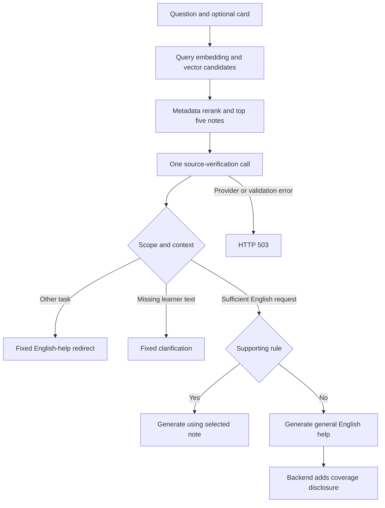

# LinguaFlow: engineering a curriculum-grounded English tutor

## 1. Problem and product boundary

A learner may know the correct drill answer without understanding why it works. A fluent explanation can still teach the wrong concept: a vocabulary question about register should not receive a lesson about tense merely because the card shares those words. The product needs short, useful explanations and an inspectable reference when its curriculum actually supports the answer.

The core distinction is **answerability versus reference coverage**. An ordinary English question can be answered from general knowledge even when this small corpus has no relevant note, with explicit disclosure. A question about absent highlighted text needs clarification. A request to choose a medicine or implement code needs redirection. Provider or index failure is a service error, never a successful abstention.

The implementation and validation of the final serving changes are described in the [release protocol](RELEASE_VALIDATION_PROTOCOL.md) and [release results](RELEASE_VALIDATION_RESULTS.md). Earlier failed experiments remain linked there. Improved learner outcomes have not been measured.

## 2. Why RAG, and why it is not automatically necessary

General language models already know basic English grammar. Retrieval here serves curriculum alignment, bounded reference context, editable teaching notes and visible source attribution. It is not a claim that the model cannot answer without retrieval.

The corpus has only 31 notes; its canonical embedding text measured 6,265 tokens in the data audit. Whole-corpus prompting is feasible. The [four-arm answer pilot](ANSWER_EVALUATION_01.md) compared card-only, whole-corpus, hybrid and verified retrieval, but nine failed judgments and mixed scores do not establish an answer-quality winner.

| Option | Advantage | Cost or limitation |
|---|---|---|
| Card-only model | Simplest and low context cost | No explicit curriculum-source selection |
| Direct item-to-note mapping | Reliable for known authored drills | Does not resolve new freeform questions |
| Entire corpus in prompt | Avoids retrieval misses at this scale | More prompt context; still needs scope and support checks |
| Hybrid retrieval plus source verification | Inspectable, bounded evidence choice | Additional provider cost, latency and selection failures |
| Fine-tuning | Could shape response style | No experiment justifies training merely to update reference content |

This project demonstrates evaluation and failure handling for retrieval, not that RAG is always the best architecture.

## 3. Data, selection and cleaning

The canonical English bundle contains 171 drills and 31 reusable teaching notes with 121 examples, 31 counterexamples and 11 external references. The notes are AI-assisted original teaching material supported by primary grammar/plain-language references. They are not scraped textbook chapters or independently validated expert labels.

Selection follows the drill objectives: passive voice, relative clauses, conditional inversion, register, nominalization and meaning-preserving vocabulary choices. Deliberate gaps, such as some article and verb-complement rules, create meaningful no-coverage cases. Small curated data makes attribution auditable but limits breadth and does not establish arbitrary-document retrieval scale.

The pipeline is versioned source → canonical English drill bundle → schema/ID/reference checks → note text formatting → embeddings → atomic index publication. Validation catches duplicate IDs, invalid authoring links, missing fields and inconsistent coverage. Cleaning also corrects semantic problems: synonyms that change actions, invented diagnoses, stronger claims introduced by formal rewrites, and nominalizations that hide actors. Counterexamples preserve the bad rewrite together with why it is wrong.

[Dataset card](DATASET_CARD.md), [data changes](DATA_CHANGELOG.md) and the checked source registry explain provenance and reference limits. A citation supporting a general rule does not certify every authored example.

## 4. Chunking and embeddings

**One note is one retrieval chunk.** These notes are already short concept units containing the rule, examples and a boundary. Splitting by arbitrary token windows would separate qualifications from examples and make source identity less meaningful. Overlap is unnecessary for these atomic notes. This decision would need re-evaluation for long documents; it is not a universal chunking rule.

The canonical embedding text includes title, use guidance, explanation, examples, boundaries and tags. The verifier has a narrower evidence view: only complete explanation/example/boundary paragraphs can support a source choice. Retrieval metadata can locate a note without proving its relevance to the answer.

`text-embedding-3-small`, 1,536 dimensions, is an economical baseline compatible with the existing pgvector stack. The repository compares retrieval algorithms, not multiple embedding models. It does not claim this embedding model is optimal. A defensible next model comparison would hold documents, questions and candidate budgets fixed; use separate indexes per model/dimension; choose on development data and measure once on held-out data.

At 31 notes, vector storage is not the primary problem. Query interpretation, source precision, abstention and network latency matter more.

## 5. Indexing and retrieval

Embeddings are prepared before an atomic publication transaction. A manifest binds full note content, canonical chunks, model, dimensions and format version. Unchanged complete snapshots skip provider work; reads reject incomplete or incompatible versions. Integration tests use disposable PostgreSQL/pgvector and verify publication, rollback and concurrency behavior.

The production migration and 31-note publication were verified previously; [deployment evidence](RELEASE_EVIDENCE_STATUS.md) identifies that historical revision. Serving changes in the current release do not alter the corpus or embedding space and do not require republishing the index.

The freeform query puts the question first and adds available card instruction, prompt and answer. That lets an elliptical question refer to its card, but a distracting card can contaminate retrieval. No query rewriting or multi-query expansion is claimed.

PostgreSQL returns up to ten vector candidates. The feature reranker uses default `0.6 × cosine + 0.4 × normalized metadata`, with metadata capped after division by 20. This is a heuristic reranker, not a trained cross-encoder or BM25 fusion. Without card metadata it is largely vector ranking. A cosine threshold of 0.30 is not a calibrated probability. The [semantic comparison](RETRIEVAL_EXPERIMENT_02.md) and [original holdout](HELDOUT_EVALUATION_01.md) document its limitations.

The source verifier inspects the top five candidates even when the preliminary winner is below threshold. It cannot recover a relevant note absent from those five. Ranking metrics and final selection metrics therefore answer different questions.

## 6. Serving policy and its trade-offs

Scope is assessed before context **inside the verifier**. Retrieval still occurs first; this design saves a separate classification call but does not save embedding/database cost on out-of-scope requests.

The verifier selects a supplied evidence ID, and the backend reconstructs its exact text and source. Only substantive paragraphs are selectable. Scope or missing context always clears sources. A narrow backend guard also prevents ordinal option references from inventing an ordered list out of separate card prompt/answer fields. It accepts explicit labels or quoted alternatives in one field; unsupported formats may require an extra clarification turn. This is not a general coreference resolver. A finite sentence rewrite must retain a finite verb, tense and participants; a related participle rule cannot be substituted merely because both describe an earlier action. General advice to be precise is insufficient evidence for an absent grammar rule.

The serving candidate pins `gpt-4.1-2025-04-14` for this single verification call: top five references, 24 KB input limit, 384 output tokens, eight-second deadline and no retries. Earlier smaller-model trials recovered recall but still confused unsupported rules and task scope. The stronger verifier is a quality/cost trade-off to validate, not an assumption of perfection. Generation remains separately selectable; the release evaluation pins GPT-4o mini, so its results do not certify every UI model choice.

Coverage disclosure is deterministic backend behavior. Generation does not need to remember to say that no note covers an answer. Clarifications and redirects do not receive that disclosure because no teaching answer was generated. The source label identifies the chosen note; it does not prove every generated sentence is grounded.

Generation has its existing 20-second async deadline. Index, embedding or verification errors produce 503; generation timeout produces 504; other generation failures produce 502 without leaking provider details. These component limits do not prove a whole-system worst-case SLA. Card actions and Tutor metadata routes remain distinct from Study freeform retrieval.

## 7. Evaluation and release decisions

| Layer | Measurements | What they establish |
|---|---|---|
| Retrieval | Recall/Hit@1,3,5, MRR@5, source precision/recall, false references, abstention and route counts | Ranking availability versus final selection/abstention |
| Answer | Correctness, fact coverage, sentence-unit faithfulness, hallucination, teaching, scope | Automated rubric estimates with stated applicability/denominators |
| Engineering | Failure counts, per-stage p50/p95, input/output/cache tokens, cost estimates | Measured local pipeline behavior, excluding browser/public HTTP and evaluation pacing |

The newer judge grades indexed sentence/line units and evidence IDs. Backend validation restores exact quotations and enforces applicability; this reduces structural grading errors without proving semantic correctness. Historical atomic-claim scores are not directly comparable. The verifier and judge share GPT-4.1, so correlated errors remain a limitation. No independent expert review, pedagogical learning-gain study or production load benchmark is claimed.

Development data is for fixing failures. The separately frozen 24-case release test is run only after development acceptance. Plans bind code, corpus, labels, snapshots, prices, budgets and targets before requests. Original failures and all attempts stay in Git; private study notes do not. Saved replay reproduces scoring from stored outputs, not stochastic API behavior.

The release gate requires source precision ≥90%, positive source recall ≥80%, false references ≤10%, correct clarification/redirect routes, and no unnecessary clarification; answer targets include correctness ≥3/4, faithfulness ≥90%, teaching ≥4/5 and scope ≥90%, with low hallucination and no failed judgments. Exact counts and confidence intervals matter more than rounded percentages on small sets. Infrastructure errors remain in end-to-end denominators and never count as correct abstention.

## 8. Operational limits and interview claims

PostgreSQL reuses the application stack; adding another vector service is difficult to justify for 31 notes. Exact search is a meaningful baseline at this scale; the presence of an approximate index is not evidence of million-document performance. The index has one active version and still needs coordinated content/index deployment.

The public demo uses provider and actor limits, and the free agent host can cold-start. Earlier warm smoke checks and local evaluation percentiles must not be presented as production p95 or a load test. Optional Langfuse export and custom DeepEval adapters exist; local validation does not establish delivery to an unconfigured cloud workspace.

The defensible claim is an implemented, evaluated curriculum-source selection system with reproducible failures, explicit fallback behavior and documented trade-offs. The stronger claim—better learning outcomes or universal superiority over a non-RAG tutor—requires evidence this project does not yet have.
